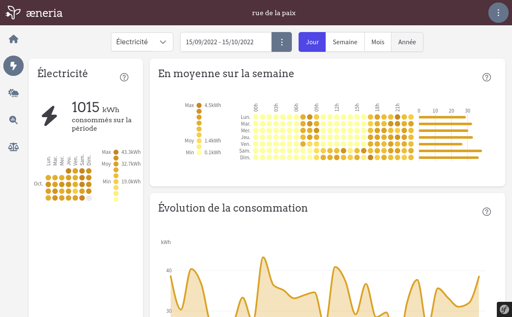
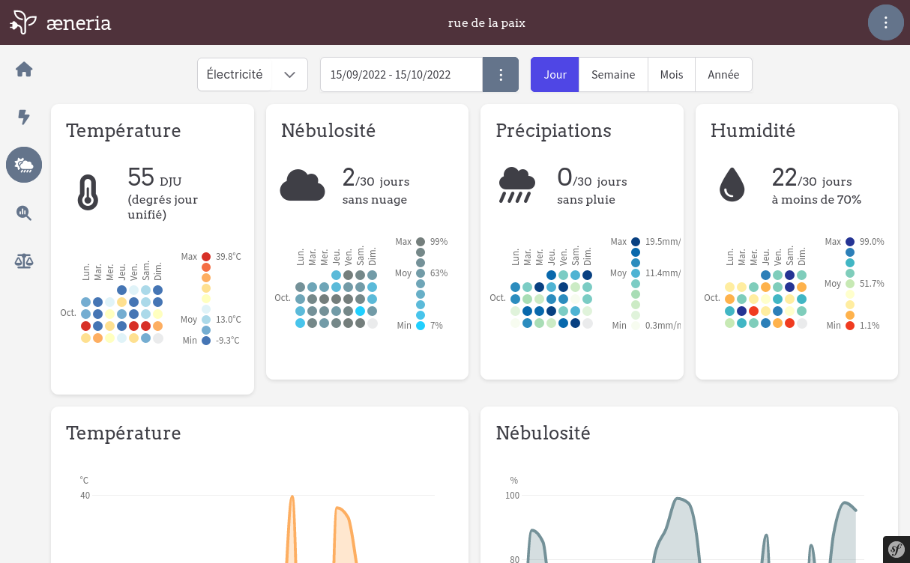

<!--
Este archivo README esta generado automaticamente<https://github.com/YunoHost/apps/tree/master/tools/readme_generator>
No se debe editar a mano.
-->

# æneria para Yunohost

[](https://dash.yunohost.org/appci/app/aeneria)  

[](https://install-app.yunohost.org/?app=aeneria)

*[Leer este README en otros idiomas.](./ALL_README.md)*

> *Este paquete le permite instalaræneria rapidamente y simplement en un servidor YunoHost.*  
> *Si no tiene YunoHost, visita [the guide](https://yunohost.org/install) para aprender como instalarla.*

## Descripción general

The idea of [æneria](https://aeneria.com) is to display energy consumption and weather data on a little dashboard that allow the user to:

 * Better understand our own energy consumption
 * Analyse energy consumption throw weather data


**Versión actual:** 2.1.1~ynh1

**Demo:** <https://demo.aeneria.com>

## Capturas





## Documentaciones y recursos

- Sitio web oficial: <https://aeneria.com>
- Documentación administrador oficial: <https://docs.aeneria.com>
- Repositorio del código fuente oficial de la aplicación : <https://gitlab.com/aeneria/aeneria-app>
- Catálogo YunoHost: <https://apps.yunohost.org/app/aeneria>
- Reportar un error: <https://github.com/YunoHost-Apps/aeneria_ynh/issues>

## Información para desarrolladores

Por favor enviar sus correcciones a la [`branch testing`](https://github.com/YunoHost-Apps/aeneria_ynh/tree/testing

Para probar la rama `testing`, sigue asÍ:

```bash
sudo yunohost app install https://github.com/YunoHost-Apps/aeneria_ynh/tree/testing --debug
o
sudo yunohost app upgrade aeneria -u https://github.com/YunoHost-Apps/aeneria_ynh/tree/testing --debug
```

**Mas informaciones sobre el empaquetado de aplicaciones:** <https://yunohost.org/packaging_apps>
