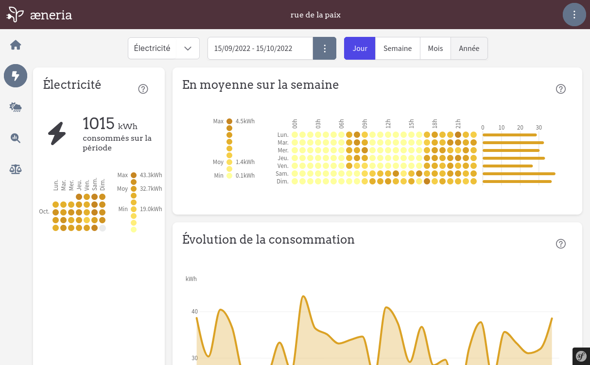

<!--
Ohart ongi: README hau automatikoki sortu da <https://github.com/YunoHost/apps/tree/master/tools/readme_generator>ri esker
EZ editatu eskuz.
-->

# æneria YunoHost-erako

[](https://dash.yunohost.org/appci/app/aeneria)  

[](https://install-app.yunohost.org/?app=aeneria)

*[Irakurri README hau beste hizkuntzatan.](./ALL_README.md)*

> *Pakete honek æneria YunoHost zerbitzari batean azkar eta zailtasunik gabe instalatzea ahalbidetzen dizu.*  
> *YunoHost ez baduzu, kontsultatu [gida](https://yunohost.org/install) nola instalatu ikasteko.*

## Aurreikuspena

The idea of [æneria](https://aeneria.com) is to display energy consumption and weather data on a little dashboard that allow the user to:

 * Better understand our own energy consumption
 * Analyse energy consumption throw weather data


**Paketatutako bertsioa:** 2.1.1~ynh1

**Demoa:** <https://demo.aeneria.com>

## Pantaila-argazkiak





## Dokumentazioa eta baliabideak

- Aplikazioaren webgune ofiziala: <https://aeneria.com>
- Administratzaileen dokumentazio ofiziala: <https://docs.aeneria.com>
- Jatorrizko aplikazioaren kode-gordailua: <https://gitlab.com/aeneria/aeneria-app>
- YunoHost Denda: <https://apps.yunohost.org/app/aeneria>
- Eman errore baten berri: <https://github.com/YunoHost-Apps/aeneria_ynh/issues>

## Garatzaileentzako informazioa

Bidali `pull request`a [`testing` abarrera](https://github.com/YunoHost-Apps/aeneria_ynh/tree/testing).

`testing` abarra probatzeko, ondorengoa egin:

```bash
sudo yunohost app install https://github.com/YunoHost-Apps/aeneria_ynh/tree/testing --debug
edo
sudo yunohost app upgrade aeneria -u https://github.com/YunoHost-Apps/aeneria_ynh/tree/testing --debug
```

**Informazio gehiago aplikazioaren paketatzeari buruz:** <https://yunohost.org/packaging_apps>
