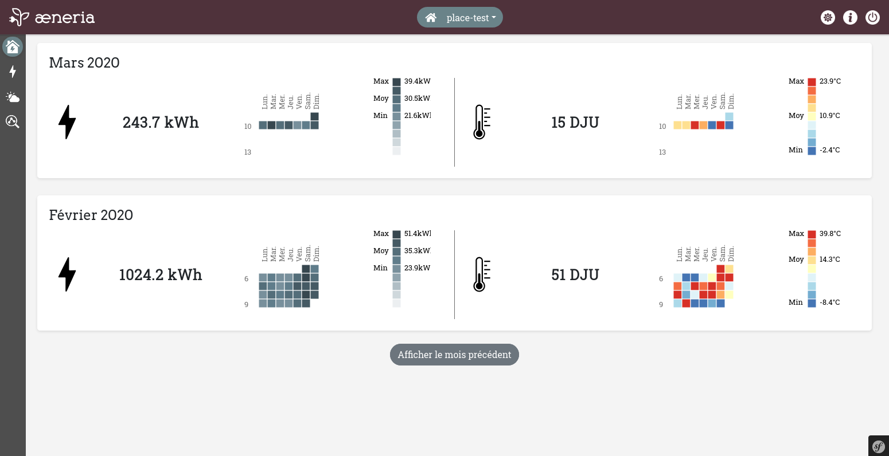

<!--
N.B.: This README was automatically generated by https://github.com/YunoHost/apps/tree/master/tools/README-generator
It shall NOT be edited by hand.
-->

# æneria pour YunoHost

[](https://dash.yunohost.org/appci/app/aeneria)  

[](https://install-app.yunohost.org/?app=aeneria)

*[Read this readme in english.](./README.md)*

> *Ce package vous permet d’installer æneria rapidement et simplement sur un serveur YunoHost.
Si vous n’avez pas YunoHost, regardez [ici](https://yunohost.org/#/install) pour savoir comment l’installer et en profiter.*

## Vue d’ensemble

The idea of [æneria](https://aeneria.com) is to display energy consumption and weather data on a little dashboard that allow the user to:

 * Better understand our own energy consumption
 * Analyse energy consumption throw weather data


**Version incluse :** 1.1.6~ynh4

## Captures d’écran



## Avertissements / informations importantes

## Configuration

* First of all, you'll need a Linky and an [Enedis account](https://mon-compte-client.enedis.fr/)
* In your Enedis space, go to ["Gérer l'accès à mes données"](https://mon-compte-particulier.enedis.fr/donnees/) tab, and allow Enedis to collect and store your hourly consumption
* After that, install æneria to your Yunohost instance, visit it and just follow instructions
* That's it, now wait a bit to see data appear !

## Comming from Pilea

æneria is the new name of Pilea. This new name came whith a brand new version.

This new version introduced some breaking changes in data structure: migration from Pilea can't be done automaticly.

But don't worry, you can easilly transfer your data from Pilea to æneria following [this documentation](https://docs.aeneria.com/fr/latest/administrateur/pilea_migration.html).

## Documentations et ressources

* Site officiel de l’app : <https://aeneria.com>
* Documentation officielle de l’admin : <https://docs.aeneria.com>
* Dépôt de code officiel de l’app : <https://gitlab.com/aeneria/aeneria-app>
* YunoHost Store: <https://apps.yunohost.org/app/aeneria>
* Signaler un bug : <https://github.com/YunoHost-Apps/aeneria_ynh/issues>

## Informations pour les développeurs

Merci de faire vos pull request sur la [branche testing](https://github.com/YunoHost-Apps/aeneria_ynh/tree/testing).

Pour essayer la branche testing, procédez comme suit.

``` bash
sudo yunohost app install https://github.com/YunoHost-Apps/aeneria_ynh/tree/testing --debug
ou
sudo yunohost app upgrade aeneria -u https://github.com/YunoHost-Apps/aeneria_ynh/tree/testing --debug
```

**Plus d’infos sur le packaging d’applications :** <https://yunohost.org/packaging_apps>